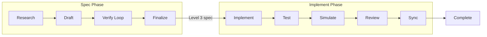
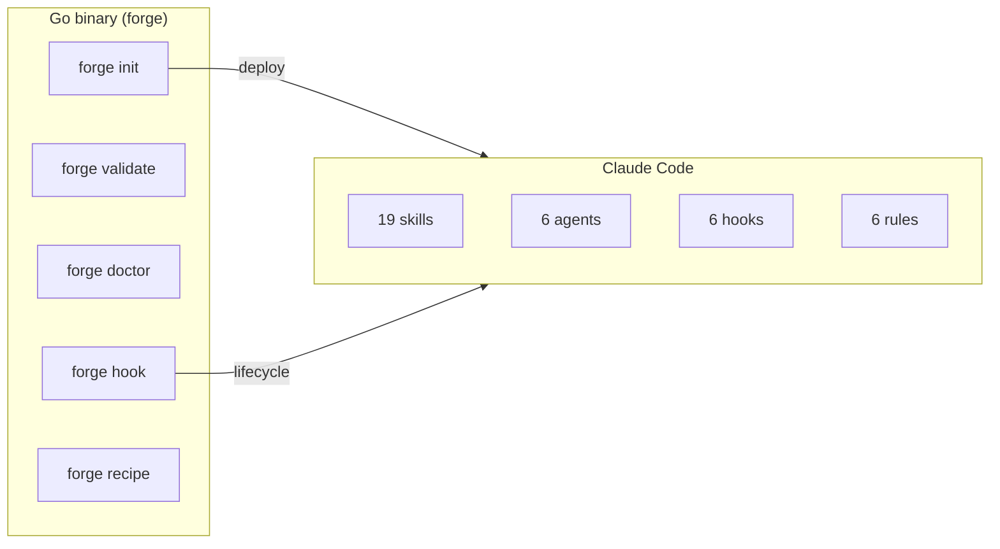

# claude-forge

ドキュメントファーストAI開発 — コードではなく仕様を反復する。

[](https://github.com/imtemp-dev/claude-forge/actions/workflows/ci.yml)
[](https://github.com/imtemp-dev/claude-forge/releases)
[](LICENSE)
[](https://go.dev)

[English](README.md) | [한국어](README.ko.md) | [中文](README.zh.md)

```
╔═══════════════════════════════════════════════════════════╗
║                                                           ║
║   ラルフモード                  リサモード                ║
║                                                           ║
║   コード -> 失敗                仕様 -> 検証              ║
║     -> コード -> 失敗             -> 仕様 -> 検証        ║
║       -> コード -> 失敗             -> 完璧な仕様         ║
║         -> ...                        -> コード           ║
║           -> 動く?                      -> 動く。         ║
║                                                           ║
║   コードをループ（高コスト）    ドキュメントをループ（低コスト）║
║   ビルド、テスト、副作用        ビルドなし、破損なし      ║
║                                                           ║
║              claude-forge はリサモードです。              ║
║                                                           ║
╚═══════════════════════════════════════════════════════════╝
```

> **ラルフはコードをループする。リサはドキュメントをループする。**
> どちらも成功するまで反復する——しかしドキュメントの変更は安全です。
> ビルドなし、テストなし、副作用なし。仕様が完璧であれば、
> AIは初回で動作するコードを生成します。

## クイックスタート

[Claude Code](https://docs.anthropic.com/en/docs/claude-code)が必要です。

```bash
# Homebrew (macOS / Linux)
brew tap imtemp-dev/tap
brew install forge

# またはワンラインインストール
curl -fsSL https://raw.githubusercontent.com/imtemp-dev/claude-forge/main/install.sh | bash

# またはソースからビルド (Go 1.22+)
git clone https://github.com/imtemp-dev/claude-forge.git && cd claude-forge && make install

# プロジェクトで初期化
cd your-project
forge init .

# Claude Codeを起動
claude
```

Claude Code内で：

```bash
# 完璧な仕様を作成 → 実装 → テスト → 完了
/recipe blueprint "OAuth2認証を追加"

# 既知のバグを修正
/recipe fix "ログインbcryptハッシュ比較失敗"

# 未知の問題をデバッグ
/recipe debug "5分後にセッションが切断される"
```

## 仕組み

forgeは仕様から動作するコードまでの全サイクルを自動化します：



**仕様フェーズ** — コードベースを調査し、詳細な仕様を起草し、すべてのファイルパス、関数シグネチャ、型、エッジケースが確定するまで（Level 3）複数ラウンドの検証を行います。検証は別のAIコンテキストを使用するため、仕様が自己検証することはありません。

**実装フェーズ** — 確定した仕様からコードを生成し、テストを実行し、コードパスをシミュレーションし、品質をレビューし、差異を仕様に同期します。各ステップには要件が満たされるまで完了をブロックする自動ゲートがあります。

**完了ゲート** — `forge`が完了マーカーを自動的に検証します。検証をパスしなければ仕様を確定できません。テスト、レビュー、同期をパスしなければ実装を完了できません。

## レシピ

| レシピ | 用途 | 出力 |
|--------|------|------|
| `/recipe blueprint` | 完全な実装仕様 | Level 3 仕様 → コード → テスト |
| `/recipe design` | 機能設計 | Level 2 設計ドキュメント |
| `/recipe analyze` | 既存システムの理解 | Level 1 分析ドキュメント |
| `/recipe fix` | 既知のバグ修正 | 修正仕様 → コード → テスト |
| `/recipe debug` | 未知のバグ調査 | 6視点分析 → 仕様 → コード |

マルチ機能プロジェクトでは、forgeが作業を**ビジョン + ロードマップ**に分解します。各レシピはロードマップ項目にマッピングされ、完了は自動的に追跡されます。

## 機能

### 19スキル

| カテゴリ | スキル |
|----------|--------|
| **レシピ** | blueprint, design, analyze, fix, debug |
| **検証** | verify, cross-check, audit, assess, sync-check |
| **分析** | research, simulate, debate, adjudicate |
| **実装** | implement, test, sync, status |
| **品質** | review (basic / security / performance / patterns) |

### ライフサイクルフック

| フック | 用途 |
|--------|------|
| session-start | コンテキスト認識再開（レシピ状態 + 次ステップヒントを注入） |
| stop | 完了ゲート（完了前に仕様、テスト、レビューを検証） |
| pre-compact | コンテキスト圧縮前にワークステートをスナップショット |
| session-end | セッション間再開のためワークステートを永続化 |

### ステータスライン

```
forge v0.1.0 │ JWT auth │ implement 3/5 │ ctx 60%
```

Claude Codeのステータスバーでレシピの進捗、フェーズ、コンテキスト使用量をリアルタイムで確認できます。

## アーキテクチャ



**Goバイナリ** — 単一の静的リンクバイナリ（約5ms起動）。状態の管理、完了の検証、テンプレートのデプロイを行います。Go以外のランタイム依存はゼロです。

**Claude Code** — スキルはレシピプロトコルを、エージェントは独立した検証を、フックはライフサイクルイベントを、ルールは制約を処理します。

## コア原則

- **ドキュメントファースト** — コードではなく仕様を反復する
- **自己検証禁止** — 検証は独立したエージェントコンテキストで実行
- **コンテキストが接着剤** — スキルはルール強制ではなく状況認識を提供
- **差異 = フォローアップ** — 仕様とコードの違いはレポートであり、ゲートではない
- **クラッシュ回復** — JSONでワークステートを永続化；セッションは自動再開
- **階層的マップ** — 軽量なプロジェクト概要、必要に応じて詳細表示
- **高速** — 単一Goバイナリ、ランタイム依存ゼロ、約5ms起動

## CLI

```
forge init [dir]              プロジェクト初期化（スキル、フック、エージェントをデプロイ）
forge doctor [recipe-id]      ヘルスチェック（システム、レシピ、ドキュメント）
forge validate [recipe-id]    JSONスキーマ準拠チェック
forge recipe status           アクティブレシピ表示
forge recipe list             全レシピ一覧
forge recipe log <id>         アクション / フェーズ / イテレーション記録
forge recipe cancel           アクティブレシピキャンセル
forge stats                   プロジェクト統計表示
forge graph                   ドキュメント依存関係グラフ表示
forge update                  バイナリバージョンに合わせてテンプレート更新
forge version                 バイナリおよびテンプレートバージョン表示
```

## 要件

- **Go** 1.22+（[インストール](https://go.dev/dl/)）
- **Claude Code**（[インストール](https://docs.anthropic.com/en/docs/claude-code)）
- **OS**：macOS、Linux（WindowsはWSL経由）

インストール後、`forge doctor`を実行して環境を確認してください。

## コントリビューション

コントリビューション歓迎です。バグ報告や機能リクエストは[issue](https://github.com/imtemp-dev/claude-forge/issues)を作成してください。

```bash
# 開発環境セットアップ
git clone https://github.com/imtemp-dev/claude-forge.git
cd claude-forge
make install          # ビルドして ~/.local/bin にインストール
go test -race ./...   # テスト実行
```

## ライセンス

MIT
