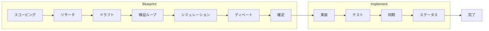
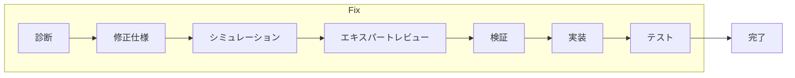
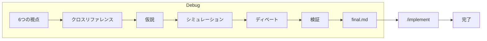

# bts — 防弾技術仕様

[English](README.md) | [한국어](README.ko.md) | [中文](README.zh.md)

```
╔════════════════════════════════════════════════════════════════╗
║                                                                ║
║   Ralph Mode                    Lisa Mode                      ║
║                                                                ║
║   code -> fail                  spec -> verify                 ║
║     -> code -> fail               -> spec -> verify            ║
║       -> code -> fail               -> spec -> verify          ║
║         -> code -> fail               -> bulletproof spec      ║
║           -> ...                        -> code                ║
║             -> works?                     -> works. first try. ║
║                                                                ║
║   Loop the CODE (expensive)     Loop the DOCS (free)           ║
║   builds, tests, side effects   no builds, no tests, no cost   ║
║                                                                ║
║                    bts is Lisa Mode.                           ║
║                                                                ║
╚════════════════════════════════════════════════════════════════╝
```

> **ラルフはコードをループする。リサはドキュメントをループする。**
> どちらも成功するまで反復する——しかしドキュメントの変更コストはゼロ。
> ビルドなし、テストなし、副作用なし。仕様が完璧であれば、
> AIは初回で動作するコードを生成します。

## フルライフサイクル







btsは**企画 → 構築 → 検証**を単一の自動化パイプラインとしてカバーします。

## インストール

```bash
# ワンラインインストール（macOS / Linux）
curl -fsSL https://raw.githubusercontent.com/jlim/bts/main/install.sh | bash

# またはソースからビルド（Go 1.22+）
git clone https://github.com/jlim/bts.git
cd bts
make install    # ~/.local/bin/btsにインストール
```

`~/.local/bin`がPATHにない場合、`.zshrc`または`.bashrc`に追加：
```bash
export PATH="$HOME/.local/bin:$PATH"
```

アップデート：
```bash
git pull && make install
```

## クイックスタート

```bash
# プロジェクトを初期化
bts init .

# Claude Codeを起動
claude

# 完璧な仕様を作成
/recipe blueprint "add OAuth2 authentication"

# 既知のバグを修正
/recipe fix "login bcrypt hash comparison fails"

# 未知の問題をデバッグ
/recipe debug "session drops after 5 minutes"

# コード品質レビュー
/bts-review
/bts-review security src/auth/

# プロジェクトの健全性チェック
bts doctor
```

## レシピ

| レシピ | 用途 | 出力 |
|--------|------|------|
| `/recipe analyze` | 既存システムの理解 | Level 1 分析ドキュメント |
| `/recipe design` | 機能設計 | Level 2 設計ドキュメント |
| `/recipe blueprint` | 完全な実装仕様 | Level 3 仕様 → コード → テスト |
| `/recipe fix` | 既知のバグ修正（軽量） | 修正仕様 → コード → テスト |
| `/recipe debug` | 未知のバグ調査 | 6視点分析 → 仕様 → コード |

## スキル（19個）

| カテゴリ | スキル |
|----------|--------|
| **レシピ** | blueprint, design, analyze, fix, debug |
| **検証** | verify, cross-check, audit, assess, sync-check |
| **分析** | research, simulate, debate, adjudicate |
| **実装** | implement, test, sync, status |
| **品質** | review（基本 / セキュリティ / パフォーマンス / パターン）|

## コア原則

- **ドキュメントファースト**：コードではなく仕様を反復する
- **自己検証禁止**：検証は独立したエージェントコンテキストで実行
- **コンテキストが接着剤**：スキルはルール強制ではなく状況認識を提供
- **差異 = フォローアップ**：仕様とコードの違いはレポートであり、ゲートではない
- **クラッシュ回復**：tasks.json + work-state.jsonでワークステートを永続化
- **高速**：単一Goバイナリ、ランタイム依存ゼロ、約5ms起動

## CLI

```
bts init [dir]              プロジェクト初期化
bts doctor [recipe-id]      レシピ健全性チェック（ドキュメント、マニフェスト、フロー）
bts validate [recipe-id]    JSONスキーマ準拠チェック
bts recipe status           アクティブレシピ表示
bts recipe list             全レシピ一覧
bts recipe log <id>         アクション/フェーズ/イテレーション記録
bts recipe cancel           アクティブレシピキャンセル
```

## ライセンス

MIT
