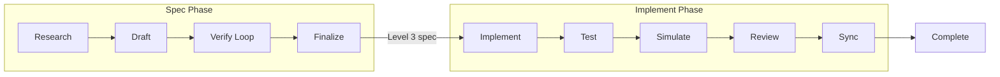
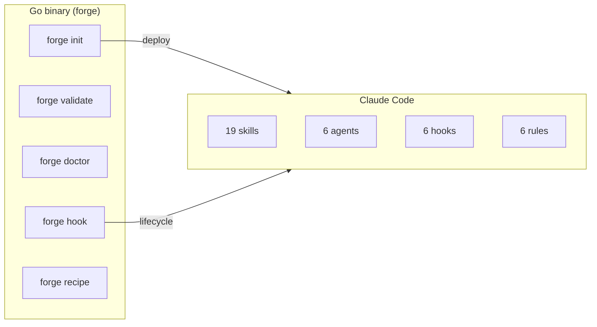

# claude-forge

문서 우선 AI 개발 — 코드가 아닌 스펙을 반복한다.

[](https://github.com/imtemp-dev/claude-forge/actions/workflows/ci.yml)
[](https://github.com/imtemp-dev/claude-forge/releases)
[](LICENSE)
[](https://go.dev)

[English](README.md) | [中文](README.zh.md) | [日本語](README.ja.md)

```
╔════════════════════════════════════════════════════════════════╗
║                                                                ║
║   랄프 모드                     리사 모드                      ║
║                                                                ║
║   코드 -> 실패                  스펙 -> 검증                   ║
║     -> 코드 -> 실패               -> 스펙 -> 검증             ║
║       -> 코드 -> 실패               -> 스펙 -> 검증           ║
║         -> 코드 -> 실패               -> 완벽한 스펙           ║
║           -> ...                        -> 코드                ║
║             -> 될까?                      -> 된다. 첫 시도에.  ║
║                                                                ║
║   코드를 루프 (비쌈)            문서를 루프 (안전하게 실패)    ║
║   빌드, 테스트, 부작용          빌드 없음, 테스트 없음, 파손 0 ║
║                                                                ║
║                  claude-forge는 리사 모드입니다.               ║
║                                                                ║
╚════════════════════════════════════════════════════════════════╝
```

> **랄프는 코드를 루프한다. 리사는 문서를 루프한다.**
> 둘 다 될 때까지 반복하지만 — 문서는 변경해도 안전합니다.
> 빌드 없음, 테스트 없음, 부작용 없음. 스펙이 완벽하면
> AI가 첫 시도에 동작하는 코드를 생성합니다.

## 빠른 시작

[Claude Code](https://docs.anthropic.com/en/docs/claude-code)가 필요합니다.

```bash
# Homebrew (macOS / Linux)
brew tap imtemp-dev/tap
brew install forge

# 또는 원라인 설치
curl -fsSL https://raw.githubusercontent.com/imtemp-dev/claude-forge/main/install.sh | bash

# 또는 소스에서 빌드 (Go 1.22+)
git clone https://github.com/imtemp-dev/claude-forge.git && cd claude-forge && make install

# 프로젝트에서 초기화
cd your-project
forge init .

# Claude Code 시작
claude
```

Claude Code 내에서:

```bash
# 완벽한 스펙 생성 → 구현 → 테스트 → 완료
/recipe blueprint "OAuth2 인증 추가"

# 알려진 버그 수정
/recipe fix "로그인 bcrypt 해시 비교 실패"

# 원인 모르는 이슈 디버그
/recipe debug "5분 후 세션 끊김"
```

## 작동 방식

forge는 스펙에서 동작하는 코드까지 전체 사이클을 자동화합니다:



**스펙 단계** — 코드베이스를 조사하고, 상세 스펙을 작성한 뒤, 모든 파일 경로, 함수 시그니처, 타입, 엣지 케이스가 확정될 때까지(Level 3) 여러 라운드의 검증을 거칩니다. 검증은 별도의 AI 컨텍스트를 사용하므로 스펙이 자기 자신을 검증하는 일은 없습니다.

**구현 단계** — 확정된 스펙에서 코드를 생성하고, 테스트를 실행하고, 코드 경로를 시뮬레이션하고, 품질을 리뷰하고, 차이를 스펙에 동기화합니다. 각 단계에는 요구사항이 충족될 때까지 완료를 차단하는 자동 게이트가 있습니다.

**완료 게이트** — `forge`가 완료 마커를 자동으로 검증합니다. 검증을 통과하지 않으면 스펙을 확정할 수 없습니다. 테스트, 리뷰, 동기화를 통과하지 않으면 구현을 완료할 수 없습니다.

## 레시피

| 레시피 | 용도 | 출력 |
|--------|------|------|
| `/recipe blueprint` | 전체 구현 스펙 | Level 3 스펙 → 코드 → 테스트 |
| `/recipe design` | 기능 설계 | Level 2 설계 문서 |
| `/recipe analyze` | 기존 시스템 이해 | Level 1 분석 문서 |
| `/recipe fix` | 알려진 버그 수정 | 수정 스펙 → 코드 → 테스트 |
| `/recipe debug` | 원인 모르는 버그 조사 | 6관점 분석 → 스펙 → 코드 |

다중 기능 프로젝트의 경우, forge는 작업을 **비전 + 로드맵**으로 분해합니다. 각 레시피는 로드맵 항목에 매핑되며 완료가 자동으로 추적됩니다.

## 기능

### 19개 스킬

| 카테고리 | 스킬 |
|----------|------|
| **레시피** | blueprint, design, analyze, fix, debug |
| **검증** | verify, cross-check, audit, assess, sync-check |
| **분석** | research, simulate, debate, adjudicate |
| **구현** | implement, test, sync, status |
| **품질** | review (basic / security / performance / patterns) |

### 라이프사이클 훅

| 훅 | 용도 |
|----|------|
| session-start | 컨텍스트 인식 재개 (레시피 상태 + 다음 단계 힌트 주입) |
| stop | 완료 게이트 (스펙, 테스트, 리뷰를 완료 전에 검증) |
| pre-compact | 컨텍스트 압축 전 작업 상태 스냅샷 |
| session-end | 세션 간 재개를 위한 작업 상태 영속화 |

### 상태 표시줄

```
forge v0.1.0 │ JWT auth │ implement 3/5 │ ctx 60%
```

Claude Code 상태 표시줄에서 레시피 진행 상황, 단계, 컨텍스트 사용량을 실시간으로 확인할 수 있습니다.

## 아키텍처



**Go 바이너리** — 단일 정적 링크 바이너리 (~5ms 시작). 상태를 관리하고, 완료를 검증하고, 템플릿을 배포합니다. Go 외에 런타임 의존성이 없습니다.

**Claude Code** — 스킬은 레시피 프로토콜을, 에이전트는 독립 검증을, 훅은 라이프사이클 이벤트를, 규칙은 제약 조건을 처리합니다.

## 핵심 원칙

- **문서 먼저** — 코드가 아닌 스펙을 반복한다
- **자기 출력 검증 금지** — 검증은 별도 에이전트 컨텍스트에서
- **컨텍스트가 글루** — 스킬은 규칙 강제가 아닌 상황 인식 제공
- **Deviation = 후속 작업** — 스펙-코드 차이는 보고서이지 게이트가 아님
- **충돌 복원** — JSON을 통한 작업 상태 영속화; 세션 자동 재개
- **계층적 맵** — 가벼운 프로젝트 개요, 필요 시 상세 정보
- **빠름** — 단일 Go 바이너리, 런타임 의존성 제로, ~5ms 시작

## CLI

```
forge init [dir]              프로젝트 초기화 (스킬, 훅, 에이전트 배포)
forge doctor [recipe-id]      건강 체크 (시스템, 레시피, 문서)
forge validate [recipe-id]    JSON 스키마 준수 확인
forge recipe status           활성 레시피 표시
forge recipe list             전체 레시피 목록
forge recipe log <id>         액션 / 단계 / 이터레이션 기록
forge recipe cancel           활성 레시피 취소
forge stats                   프로젝트 통계 표시
forge graph                   문서 의존성 그래프 표시
forge update                  바이너리 버전에 맞게 템플릿 업데이트
forge version                 바이너리 및 템플릿 버전 표시
```

## 요구 사항

- **Go** 1.22+ ([설치](https://go.dev/dl/))
- **Claude Code** ([설치](https://docs.anthropic.com/en/docs/claude-code))
- **OS**: macOS, Linux (Windows는 WSL 사용)

설치 후 `forge doctor`를 실행하여 환경을 확인하세요.

## 기여

기여를 환영합니다. 버그 보고나 기능 요청은 [이슈](https://github.com/imtemp-dev/claude-forge/issues)를 열어주세요.

```bash
# 개발 환경 설정
git clone https://github.com/imtemp-dev/claude-forge.git
cd claude-forge
make install          # 빌드 후 ~/.local/bin에 설치
go test -race ./...   # 테스트 실행
```

## 라이선스

MIT
