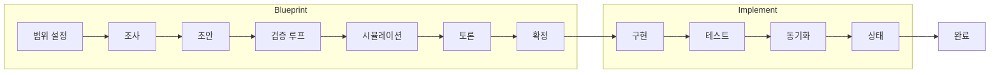
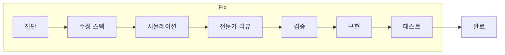
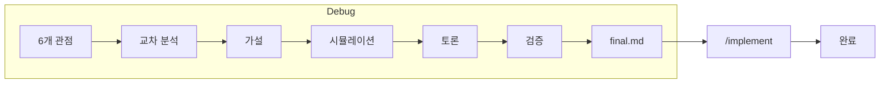

# bts — 방탄 기술 사양

[English](README.md) | [中文](README.zh.md) | [日本語](README.ja.md)

```
╔════════════════════════════════════════════════════════════════╗
║                                                                ║
║   랄프 모드                     리사 모드                      ║
║                                                                ║
║   코드 -> 실패                  스펙 -> 검증                   ║
║     -> 코드 -> 실패               -> 스펙 -> 검증             ║
║       -> 코드 -> 실패               -> 스펙 -> 검증           ║
║         -> 코드 -> 실패               -> 완벽한 스펙           ║
║           -> ...                        -> 코드                ║
║             -> 될까?                      -> 된다. 첫 시도에.  ║
║                                                                ║
║   코드를 루프 (비쌈)            문서를 루프 (안전하게 실패)    ║
║   빌드, 테스트, 부작용          빌드 없음, 테스트 없음, 파손 0 ║
║                                                                ║
║                  bts는 리사 모드입니다.                         ║
║                                                                ║
╚════════════════════════════════════════════════════════════════╝
```

> **랄프는 코드를 루프한다. 리사는 문서를 루프한다.**
> 둘 다 될 때까지 반복하지만 — 문서는 변경 비용이 제로입니다.
> 빌드 없음, 테스트 없음, 부작용 없음. 스펙이 완벽하면
> AI가 첫 시도에 동작하는 코드를 생성합니다.

## 전체 라이프사이클







bts는 **기획 → 구현 → 검증**을 하나의 자동화된 파이프라인으로 다룹니다.

## 설치

```bash
# 원라인 설치 (macOS / Linux)
curl -fsSL https://raw.githubusercontent.com/jlim/bts/main/install.sh | bash

# 또는 소스에서 빌드 (Go 1.22+)
git clone https://github.com/jlim/bts.git
cd bts
make install    # ~/.local/bin/bts에 설치
```

`~/.local/bin`이 PATH에 없으면 `.zshrc` 또는 `.bashrc`에 추가:
```bash
export PATH="$HOME/.local/bin:$PATH"
```

업데이트:
```bash
git pull && make install
```

## 빠른 시작

```bash
# 프로젝트 초기화
bts init .

# Claude Code 시작
claude

# 완벽한 스펙 생성
/recipe blueprint "OAuth2 인증 추가"

# 알려진 버그 수정
/recipe fix "로그인 bcrypt 해시 비교 실패"

# 원인 모르는 이슈 디버그
/recipe debug "5분 후 세션 끊김"

# 코드 품질 리뷰
/bts-review
/bts-review security src/auth/

# 프로젝트 건강 체크
bts doctor
```

## 레시피

| 레시피 | 용도 | 출력 |
|--------|------|------|
| `/recipe analyze` | 기존 시스템 이해 | Level 1 분석 문서 |
| `/recipe design` | 기능 설계 | Level 2 설계 문서 |
| `/recipe blueprint` | 전체 구현 스펙 | Level 3 스펙 → 코드 → 테스트 |
| `/recipe fix` | 알려진 버그 수정 (경량) | 수정 스펙 → 코드 → 테스트 |
| `/recipe debug` | 원인 모르는 버그 조사 | 6관점 분석 → 스펙 → 코드 |

## 스킬 (19개)

| 카테고리 | 스킬 |
|----------|------|
| **레시피** | blueprint, design, analyze, fix, debug |
| **검증** | verify, cross-check, audit, assess, sync-check |
| **분석** | research, simulate, debate, adjudicate |
| **구현** | implement, test, sync, status |
| **품질** | review (basic / security / performance / patterns) |

## 핵심 원칙

- **문서 먼저**: 코드가 아닌 스펙을 반복한다
- **자기 출력 검증 금지**: 검증은 별도 에이전트 컨텍스트에서
- **컨텍스트가 글루**: 스킬은 규칙 강제가 아닌 상황 인식 제공
- **Deviation = 후속 작업**: 스펙-코드 차이는 보고서이지 게이트가 아님
- **충돌 복원**: tasks.json + work-state.json으로 작업 상태 유지
- **빠름**: 단일 Go 바이너리, 런타임 의존성 제로, ~5ms 시작

## CLI

```
bts init [dir]              프로젝트 초기화
bts doctor [recipe-id]      레시피 건강 체크 (문서, 매니페스트, 플로우)
bts validate [recipe-id]    JSON 스키마 준수 확인
bts recipe status           활성 레시피 표시
bts recipe list             전체 레시피 목록
bts recipe log <id>         액션/단계/이터레이션 기록
bts recipe cancel           활성 레시피 취소
```

## 라이선스

MIT
