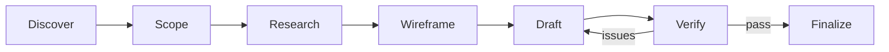
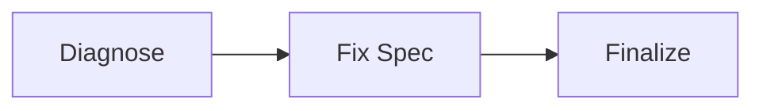
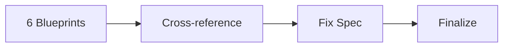
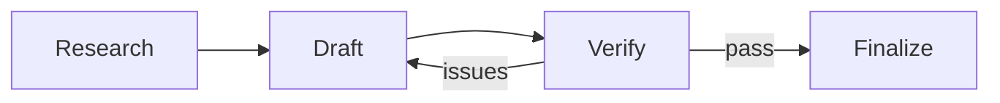
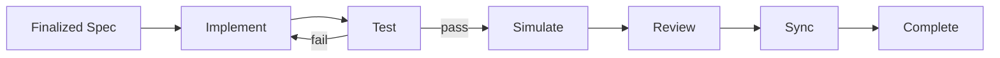

# claude-forge

Verify before you code — forge catches spec errors before they become debugging sessions.

[](https://github.com/imtemp-dev/claude-forge/actions/workflows/ci.yml)
[](https://github.com/imtemp-dev/claude-forge/releases)
[](LICENSE)
[](https://go.dev)

[한국어](README.ko.md) | [中文](README.zh.md) | [日本語](README.ja.md)

## Why

If you use Claude Code seriously, you've probably built your own process: reminding AI of the overall architecture, asking it to review its own output, checking edge cases. This works — and it's the right instinct.

But doing it manually, every time, has real limits:

- **It's inconsistent.** Some sessions you remember to ask for a review. Some you forget. The quality depends on how diligent you are that day.
- **Errors are cheaper to fix earlier.** When a mistake in the plan goes straight to code, it spreads across files and costs builds, tests, and debugging to fix. The same mistake caught in the plan costs a text edit. But without a verification step, plan-level errors have no chance to be caught before they become code-level problems.
- **Implementation drowns the destination.** AI can plan, but once it's deep in code — fixing a type error, chasing a test failure — it loses sight of what the finished system should look like as a whole. forge addresses this by starting with intent, scope, and wireframe: establishing the big picture before details consume the context.

The pattern is always the same: you're doing quality control through conversation, repeating it from scratch every session, with no guarantee that what was caught last time gets caught again.

## What forge does

forge is a CLI tool that plugs into Claude Code's lifecycle hooks. It structures the process you're already doing — but makes it automatic, tracked, and verified by separate AI contexts.

**Structured big picture first.** Before any code, forge walks through intent discovery, scope definition, and wireframe design. This gives every later step — drafting, verification, implementation — a destination to refer back to, so AI doesn't optimize for the immediate problem at the expense of the whole.

**Isolated verification.** When AI reviews its own output in the same session, it shares the same blind spots. forge runs verification in a separate agent context — a different AI instance that doesn't share the conversation history that produced the document.

**State tracking across sessions.** forge records every issue found during verification, tracks which ones are resolved, and persists this across sessions and context compactions. When a session resumes, it knows exactly where you left off and what's still open.

**Completion gates.** A spec can't be finalized until verification passes. Implementation can't complete until tests pass, review is done, and spec-code deviations are documented. These gates are enforced automatically — they don't depend on you remembering to check.

The underlying idea is simple: **catch errors in documents instead of in code.** Fixing a spec is a text edit. Fixing code is a build-test-debug cycle. The more errors filtered out before implementation starts, the less rework after.

## Quick Start

Requires [Claude Code](https://docs.anthropic.com/en/docs/claude-code).

```bash
# Homebrew (macOS / Linux)
brew tap imtemp-dev/tap
brew install forge

# Or one-line install
curl -fsSL https://raw.githubusercontent.com/imtemp-dev/claude-forge/main/install.sh | bash

# Or build from source (Go 1.22+)
git clone https://github.com/imtemp-dev/claude-forge.git && cd claude-forge && make install

# Initialize in your project
cd your-project
forge init .

# Start Claude Code
claude
```

Then inside Claude Code:

```bash
# Create a bulletproof spec → implement → test → complete
/forge-recipe-blueprint add OAuth2 authentication

# Fix a known bug
/forge-recipe-fix login bcrypt hash comparison fails

# Debug an unknown issue
/forge-recipe-debug session drops after 5 minutes
```

## How It Works

forge splits work into two phases: **spec** and **implementation**. Each recipe type has its own spec phase, but all share the same implementation loop.

In the spec phase, forge iterates on documents — discovering intent, researching the codebase, drafting a detailed design, and verifying it through multiple rounds in separate AI contexts. Errors caught here cost a text edit.

In the implementation phase, forge generates code from the finalized spec, runs tests (retrying on failure), simulates code paths, reviews for quality, and syncs deviations back to the spec. Each step has an automatic gate that blocks completion until requirements are met.

See [Recipe Lifecycles](#recipe-lifecycles) for the detailed flow of each recipe type.

## Recipes

| Recipe | Purpose | Output |
|--------|---------|--------|
| `/forge-recipe-blueprint` | Full implementation spec | Level 3 spec → code → tests |
| `/forge-recipe-design` | Design a feature | Level 2 design doc |
| `/forge-recipe-analyze` | Understand existing system | Level 1 analysis doc |
| `/forge-recipe-fix` | Known bug fix | Fix spec → code → tests |
| `/forge-recipe-debug` | Unknown bug investigation | 6-perspective analysis → spec → code |

For multi-feature projects, forge decomposes work into a **vision + roadmap**. Each recipe maps to a roadmap item and completion is tracked automatically.

## Features

### 21 Skills

| Category | Skills |
|----------|--------|
| **Recipes** | blueprint, design, analyze, fix, debug |
| **Discovery** | discover, wireframe |
| **Verification** | verify, cross-check, audit, assess, sync-check |
| **Analysis** | research, simulate, debate, adjudicate |
| **Implementation** | implement, test, sync, status |
| **Quality** | review (basic / security / performance / patterns) |

### Lifecycle Hooks

| Hook | Purpose |
|------|---------|
| session-start | Context-aware resume (injects recipe state + next-step hint) |
| stop | Completion gates (validates specs, tests, reviews before allowing completion) |
| pre-compact | Snapshots work state before context compaction |
| session-end | Persists work state for cross-session resume |
| post-tool-use | Tracks tool usage metrics (tool name, file, success/failure) |
| subagent-start/stop | Tracks subagent lifecycle for metrics |

### Metrics & Cost Estimation

```
forge stats
```

```
Project Overview
────────────────────────────────────────
  Recipes:     3 complete, 1 active, 4 total
  Sessions:    12 total, 5 compactions
  Models:      claude-opus-4-6, claude-sonnet-4-6

Estimated Cost
────────────────────────────────────────
  Total:       $4.52
  Input:       $1.23
  Output:      $2.89
  Cache Read:  $0.15
  Cache Write: $0.25

Recent Sessions
────────────────────────────────────────
  s-abc123  opus-4-6     12m 30s  $2.34  45.0K in / 8.0K out
  s-def456  sonnet-4-6    5m 10s  $0.89  20.0K in / 3.0K out
```

Session-level and recipe-level token tracking with model-specific cost estimation. Export to CSV (`--csv`) or JSON (`--json`) for external analysis.

### Statusline

```
forge v0.1.0 │ JWT auth │ implement 3/5 │ ctx 60%
```

Real-time recipe progress, phase, and context usage in Claude Code's status bar.

### Document Visualization

```bash
forge graph              # Project-wide document relationships
forge graph <recipe-id>  # Recipe-specific document graph
```

Generates mermaid diagrams showing document dependencies, debate conclusions, and verification chains.

## Recipe Lifecycles

Each recipe type has its own spec phase. Recipes that produce code share the same implementation phase.

### Spec Phase (per recipe type)

**Blueprint** — full spec for new features:



**Fix** — lightweight diagnosis:



**Debug** — multi-perspective root cause analysis:



**Design** / **Analyze** — spec-only, no implementation:



### Implementation Phase (shared)

All recipes that produce code enter the same implementation loop via `/forge-implement`:



## Architecture

**Go binary** — Single statically-linked binary (~5ms startup). Manages state, validates completion, deploys templates, tracks metrics. Zero runtime dependencies beyond Go.

**Claude Code integration** — 21 skills provide recipe protocols, 8 lifecycle hooks handle session events (resume, completion gates, metrics), 6 rules enforce constraints. Verification always runs in separate agent contexts.

## Models & Configuration

forge uses two tiers of AI models:

**Main session model** — whatever you're running in Claude Code (Opus, Sonnet, etc.) handles all primary work: drafting specs, implementing code, running debates, orchestrating the lifecycle.

**Specialist agents** — verification, audit, simulation, and review run in **separate agent contexts** (fork) so they don't share blind spots with the main session. These default to Sonnet and are configurable in `.forge/config/settings.yaml`:

```yaml
agents:
  verifier: sonnet       # /forge-verify — logical consistency
  auditor: sonnet        # /forge-audit — completeness check
  simulator: sonnet      # /forge-simulate — scenario walkthrough
  reviewer_quality: sonnet   # /forge-review — code quality
  reviewer_security: sonnet  # /forge-review — security review
  reviewer_arch: sonnet      # /forge-review — architecture review
```

Options: `sonnet` (balanced), `opus` (deeper analysis, higher cost), `haiku` (fast, may miss subtle issues).

### What runs where

| Phase | Skill | Context | Model |
|-------|-------|---------|-------|
| Discover, Scope, Research | discover, blueprint, research | main | Your session model |
| Wireframe, Draft, Improve | wireframe, blueprint | main | Your session model |
| Debate, Adjudicate | debate, adjudicate | main | Your session model |
| **Verify** | verify | **fork** | `agents.verifier` |
| **Audit** | audit | **fork** | `agents.auditor` |
| **Simulate** | simulate | **fork** | `agents.simulator` |
| **Cross-check, Sync-check** | cross-check, sync-check | **fork** | Sonnet |
| Implement, Test, Sync | implement, test, sync | main | Your session model |
| **Review** (3 parallel agents) | review | **fork** | `agents.reviewer_*` |
| Status | status | main | Your session model |

The fork context is key — when the same model reviews its own output in the same session, it shares the same blind spots. Fork agents only see the document, not the conversation that produced it.

## Key Principles

- **Document first** — Iterate on the spec, not the code
- **Never verify your own output** — Verification uses separate agent contexts
- **Context as glue** — Skills provide situational awareness, not rigid rules
- **Deviation = follow-up** — Spec-code differences are reports, not gates
- **Crash resilient** — Work state persists via JSON; sessions resume automatically
- **Hierarchical map** — Lightweight project overview, detail on demand
- **Fast** — Single Go binary, zero runtime dependencies, ~5ms startup

## CLI

```
forge init [dir]              Initialize project (deploy skills, hooks, rules)
forge doctor [recipe-id]      Health check (system, recipe, documents)
forge validate [recipe-id]    JSON schema compliance check
forge verify <file>           Check document consistency, assess level
forge recipe status           Show active recipe
forge recipe list             All recipes
forge recipe create           Create a new recipe
forge recipe log <id>         Record action / phase / iteration
forge recipe cancel           Cancel active recipe
forge stats [recipe-id]       Metrics and cost estimation (--json, --csv)
forge graph [recipe-id]       Document relationship visualization (--all)
forge sync-check <id>         Verify documents are in sync within a recipe
forge update                  Update templates to match binary version
forge version                 Show binary and template versions
```

## Requirements

- **Go** 1.22+ ([install](https://go.dev/dl/))
- **Claude Code** ([install](https://docs.anthropic.com/en/docs/claude-code))
- **OS**: macOS, Linux (Windows via WSL)

Run `forge doctor` after installation to verify your environment.

## Contributing

Contributions welcome. Please open an [issue](https://github.com/imtemp-dev/claude-forge/issues) for bug reports or feature requests.

```bash
# Development setup
git clone https://github.com/imtemp-dev/claude-forge.git
cd claude-forge
make install          # build and install to ~/.local/bin
go test -race ./...   # run tests
```

## License

MIT
