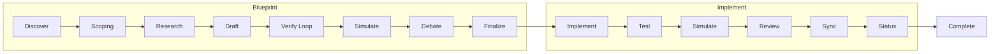
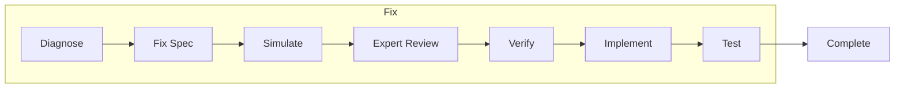
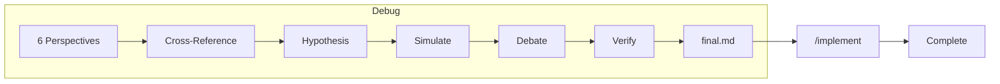
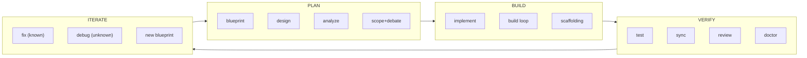
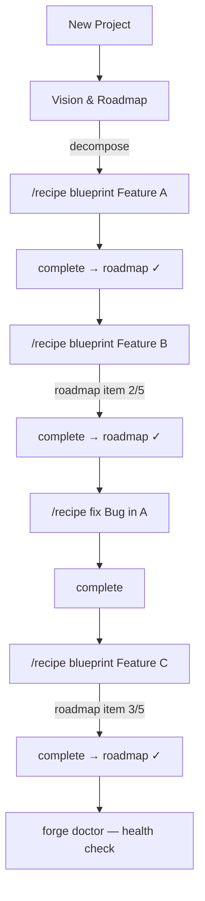
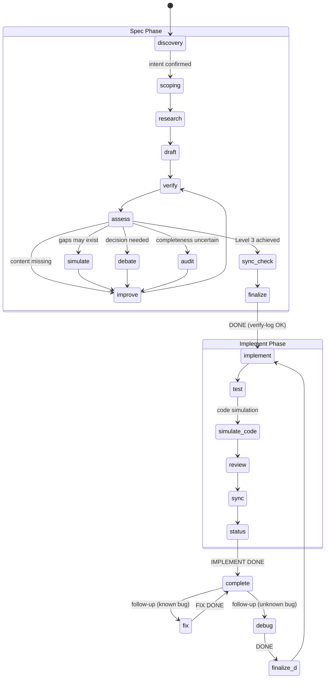
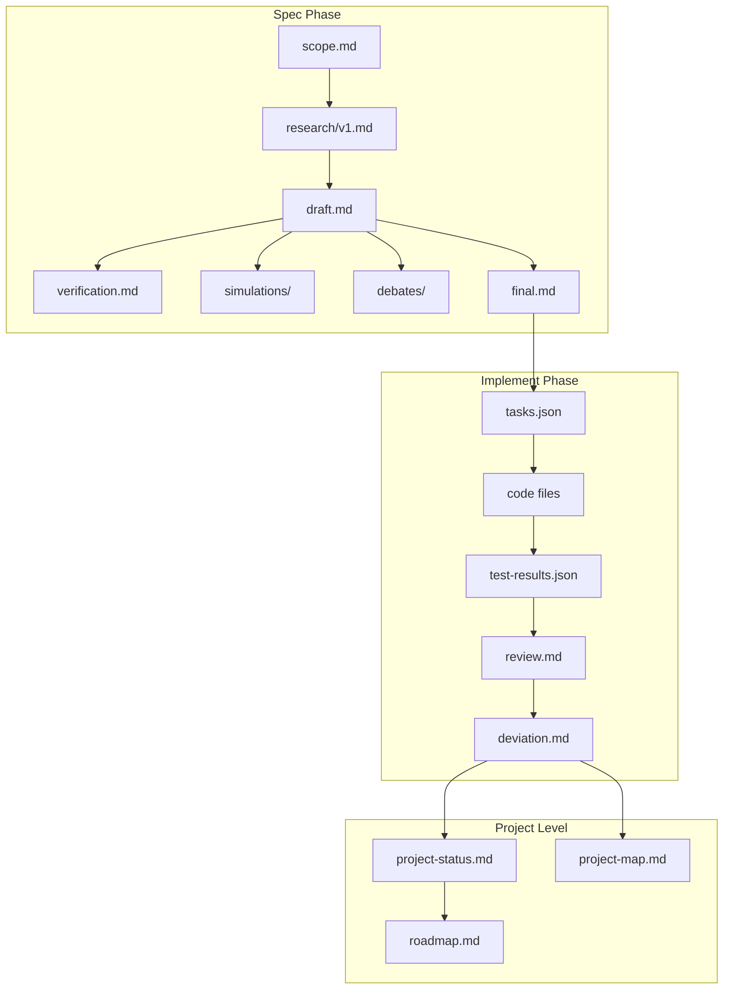
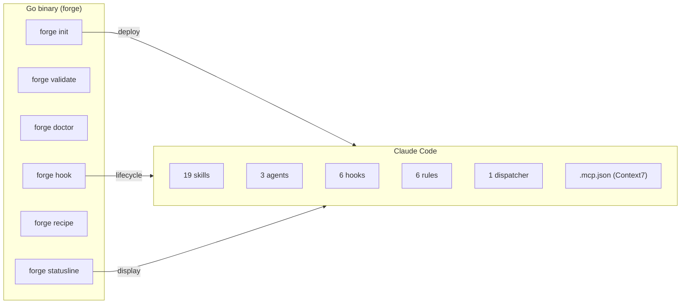

# claude-forge — Bulletproof Technical Specification

[한국어](README.ko.md) | [中文](README.zh.md) | [日本語](README.ja.md)

```
╔════════════════════════════════════════════════════════════════╗
║                                                                ║
║   Ralph Mode                    Lisa Mode                      ║
║                                                                ║
║   code -> fail                  spec -> verify                 ║
║     -> code -> fail               -> spec -> verify            ║
║       -> code -> fail               -> spec -> verify          ║
║         -> code -> fail               -> bulletproof spec      ║
║           -> ...                        -> code                ║
║             -> works?                     -> works. first try. ║
║                                                                ║
║   Loop the CODE (expensive)     Loop the DOCS (safe to fail)   ║
║   builds, tests, side effects   no builds, no tests, no breakage║
║                                                                ║
║                    claude-forge is Lisa Mode.                           ║
║                                                                ║
╚════════════════════════════════════════════════════════════════╝
```

> **Ralph loops code. Lisa loops documents.**
> Both iterate until it works — but documents are safe to change.
> No builds, no tests, no side effects. When the spec is bulletproof,
> AI generates working code on the first try.

## Full Lifecycle







forge covers **Planning → Build → Verify** as a single automated pipeline.

## Install

```bash
# One-line install (macOS / Linux)
curl -fsSL https://raw.githubusercontent.com/jlim/claude-forge/main/install.sh | bash

# Or build from source (Go 1.22+)
git clone https://github.com/jlim/claude-forge.git
cd claude-forge
make install    # installs to ~/.local/bin/forge
```

If `~/.local/bin` is not in your PATH, add it to `.zshrc` or `.bashrc`:
```bash
export PATH="$HOME/.local/bin:$PATH"
```

Update:
```bash
git pull && make install
```

Check version:
```bash
forge --version
```

## Quick Start

```bash
# Initialize in your project
forge init .

# Start Claude Code
claude

# Create a bulletproof spec
/recipe blueprint "add OAuth2 authentication"

# Fix a known bug
/recipe fix "login bcrypt hash comparison fails"

# Debug an unknown issue
/recipe debug "session drops after 5 minutes"

# Review code quality
/forge-review
/forge-review security src/auth/

# Check project health
forge doctor
```

## Development Process

How forge fits into a real development lifecycle:



Typical project progression:



## Development Lifecycle

forge maps to a standard development process:

```
Requirements → Planning → Design → Implementation → Verification → Release
     ↓            ↓         ↓           ↓                ↓           ↓
  discover     vision    blueprint   implement        test+review   sync+status
  (intent)    roadmap    (spec)      (code)          simulate      (complete)
               scope
```

## State Machine



### Stop Hook Gates

| Marker | Validates | Sets phase |
|--------|-----------|------------|
| `<forge>DONE</forge>` | verification.md + verify-log: critical=0, major=0 | → finalize |
| `<forge>IMPLEMENT DONE</forge>` | tasks done + tests pass + review.md + deviation.md | → complete |
| `<forge>FIX DONE</forge>` | fix-spec.md + tests pass | → complete |

## Document Flow



### Project-level Documents

```
.forge/state/
├── vision.md               Product vision (purpose, components, constraints)
├── roadmap.md              Ordered recipe decomposition (checkbox items)
├── project-map.md          Level 0: layer overview (~300 tokens)
├── layers/{name}.md        Level 1: layer detail (on-demand)
├── project-status.md       Recipe status table + architecture
└── recipes/
    ├── r-1001/             Blueprint: scope.md, final.md, deviation.md, ...
    ├── r-fix-1002/         Fix: diagnosis.md, fix-spec.md, ...
    └── r-debug-1003/       Debug: perspectives.md, final.md, ...
```

**Vision & Roadmap**: Large features auto-decompose into recipe-sized units.
`vision.md` captures the final product vision; `roadmap.md` tracks ordered
items with checkbox progress. Each recipe links to its roadmap item, and
completion automatically marks it done.

## Recipes

| Recipe | Purpose | Output |
|--------|---------|--------|
| `/recipe analyze` | Understand existing system | Level 1 analysis doc |
| `/recipe design` | Design a feature | Level 2 design doc |
| `/recipe blueprint` | Full implementation spec | Level 3 spec → code → tests |
| `/recipe fix` | Known bug fix (lightweight) | Fix spec → code → tests |
| `/recipe debug` | Unknown bug investigation | 6-perspective analysis → spec → code |

## Skills (19)

| Category | Skills |
|----------|--------|
| **Recipes** | blueprint, design, analyze, fix, debug |
| **Verification** | verify, cross-check, audit, assess, sync-check |
| **Analysis** | research, simulate, debate, adjudicate |
| **Implementation** | implement, test, sync, status |
| **Quality** | review (basic / security / performance / patterns) |

## Architecture



### Hooks

| Hook | Purpose |
|------|---------|
| session-start | Source-aware context injection (resume/compact/startup) |
| pre-compact | Work state snapshot before context compaction |
| session-end | Work state persistence for cross-session resume |
| stop | Completion gates (DONE / IMPLEMENT DONE / FIX DONE) |
| subagent-start/stop | 🟡 indicator on statusline during agent execution |

### Statusline

```
forge v0.1.0 │ JWT auth │ 🟡 verify │ ctx 45%
forge v0.1.0 │ JWT auth │ implement 3/5 │ ctx 60%
forge v0.1.0 │ bcrypt fix │ test │ ctx 30%
```

### Project Map

Lightweight project overview, auto-synced on recipe completion:
```
.forge/state/project-map.md     — Level 0: layer paths + build/test commands
.forge/state/layers/{name}.md   — Level 1: on-demand detail per layer
```

## Key Principles

- **Document first**: Iterate on the spec, not the code
- **Never verify your own output**: Verification uses separate agent contexts
- **Context as glue**: Skills provide situational awareness, not rigid rules
- **Deviation = follow-up**: Spec-code differences are reports, not gates
- **Crash resilient**: Work state persists via tasks.json + work-state.json
- **Hierarchical map**: Lightweight project overview, detail on demand
- **Fast**: Single Go binary, zero runtime dependencies, ~5ms startup

## CLI

```
forge init [dir]              Initialize project
forge doctor [recipe-id]      Recipe health check (documents, manifest, flow, vision/roadmap)
forge validate [recipe-id]    Check JSON schema compliance
forge version                 Show binary and template versions
forge update                  Deploy latest templates
forge recipe status           Show active recipe
forge recipe list             All recipes
forge recipe log <id>         Record action/phase/iteration
forge recipe cancel           Cancel active recipe
forge debate list             All debates
forge statusline              Render status for Claude Code (internal)
forge hook <event>            Handle lifecycle events (internal)
```

## Document Levels

| Level | Name | Contains | AI Code Accuracy |
|-------|------|----------|-----------------|
| 1 | Understanding | System structure, files, dependencies | Not possible |
| 2 | Design | Components, data flow, tech choices | ~60-70% |
| 3 | Implementation-ready | File paths, signatures, types, edge cases, scaffolding | **Very high** |

## License

MIT
