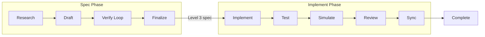
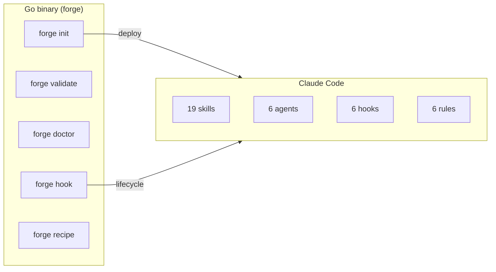

# claude-forge

Document-first AI development — iterate on specs, not code.

[](https://github.com/imtemp-dev/claude-forge/actions/workflows/ci.yml)
[](https://github.com/imtemp-dev/claude-forge/releases)
[](LICENSE)
[](https://go.dev)

[한국어](README.ko.md) | [中文](README.zh.md) | [日本語](README.ja.md)

```
╔═══════════════════════════════════════════════════════════╗
║                                                           ║
║   Ralph Mode                    Lisa Mode                 ║
║                                                           ║
║   code -> fail                  spec -> verify            ║
║     -> code -> fail               -> spec -> verify       ║
║       -> code -> fail               -> bulletproof spec   ║
║         -> ...                        -> code             ║
║           -> works?                     -> works.         ║
║                                                           ║
║   Loop the CODE (expensive)     Loop the DOCS (cheap)     ║
║   builds, tests, side effects   no builds, no breakage    ║
║                                                           ║
║                  claude-forge is Lisa Mode.                ║
║                                                           ║
╚═══════════════════════════════════════════════════════════╝
```

> **Ralph loops code. Lisa loops documents.**
> Both iterate until it works — but documents are safe to change.
> No builds, no tests, no side effects. When the spec is bulletproof,
> AI generates working code on the first try.

## Quick Start

Requires [Claude Code](https://docs.anthropic.com/en/docs/claude-code).

```bash
# Homebrew (macOS / Linux)
brew tap imtemp-dev/tap
brew install forge

# Or one-line install
curl -fsSL https://raw.githubusercontent.com/imtemp-dev/claude-forge/main/install.sh | bash

# Or build from source (Go 1.22+)
git clone https://github.com/imtemp-dev/claude-forge.git && cd claude-forge && make install

# Initialize in your project
cd your-project
forge init .

# Start Claude Code
claude
```

Then inside Claude Code:

```bash
# Create a bulletproof spec → implement → test → complete
/recipe blueprint "add OAuth2 authentication"

# Fix a known bug
/recipe fix "login bcrypt hash comparison fails"

# Debug an unknown issue
/recipe debug "session drops after 5 minutes"
```

## How It Works

forge automates the full cycle from spec to working code:



**Spec Phase** — Research the codebase, draft a detailed spec, then verify it through multiple rounds until every file path, function signature, type, and edge case is nailed down (Level 3). Verification uses separate AI contexts so the spec is never checking its own work.

**Implement Phase** — Generate code from the finalized spec, run tests, simulate code paths, review for quality, and sync any deviations back to the spec. Each step has an automatic gate that blocks completion until requirements are met.

**Completion Gates** — `forge` validates completion markers automatically. A spec can't be finalized without passing verification. Implementation can't complete without passing tests, review, and sync.

## Recipes

| Recipe | Purpose | Output |
|--------|---------|--------|
| `/recipe blueprint` | Full implementation spec | Level 3 spec → code → tests |
| `/recipe design` | Design a feature | Level 2 design doc |
| `/recipe analyze` | Understand existing system | Level 1 analysis doc |
| `/recipe fix` | Known bug fix | Fix spec → code → tests |
| `/recipe debug` | Unknown bug investigation | 6-perspective analysis → spec → code |

For multi-feature projects, forge decomposes work into a **vision + roadmap**. Each recipe maps to a roadmap item and completion is tracked automatically.

## Features

### 19 Skills

| Category | Skills |
|----------|--------|
| **Recipes** | blueprint, design, analyze, fix, debug |
| **Verification** | verify, cross-check, audit, assess, sync-check |
| **Analysis** | research, simulate, debate, adjudicate |
| **Implementation** | implement, test, sync, status |
| **Quality** | review (basic / security / performance / patterns) |

### Lifecycle Hooks

| Hook | Purpose |
|------|---------|
| session-start | Context-aware resume (injects recipe state + next-step hint) |
| stop | Completion gates (validates specs, tests, reviews before allowing completion) |
| pre-compact | Snapshots work state before context compaction |
| session-end | Persists work state for cross-session resume |

### Statusline

```
forge v0.1.0 │ JWT auth │ implement 3/5 │ ctx 60%
```

Real-time recipe progress, phase, and context usage in Claude Code's status bar.

## Architecture



**Go binary** — Single statically-linked binary (~5ms startup). Manages state, validates completion, deploys templates. Zero runtime dependencies beyond Go.

**Claude Code** — Skills provide recipe protocols, agents run isolated verification, hooks handle lifecycle events, rules enforce constraints.

## Key Principles

- **Document first** — Iterate on the spec, not the code
- **Never verify your own output** — Verification uses separate agent contexts
- **Context as glue** — Skills provide situational awareness, not rigid rules
- **Deviation = follow-up** — Spec-code differences are reports, not gates
- **Crash resilient** — Work state persists via JSON; sessions resume automatically
- **Hierarchical map** — Lightweight project overview, detail on demand
- **Fast** — Single Go binary, zero runtime dependencies, ~5ms startup

## CLI

```
forge init [dir]              Initialize project (deploy skills, hooks, agents)
forge doctor [recipe-id]      Health check (system, recipe, documents)
forge validate [recipe-id]    JSON schema compliance check
forge recipe status           Show active recipe
forge recipe list             All recipes
forge recipe log <id>         Record action / phase / iteration
forge recipe cancel           Cancel active recipe
forge update                  Update templates to match binary version
forge version                 Show binary and template versions
```

## Requirements

- **Go** 1.22+ ([install](https://go.dev/dl/))
- **Claude Code** ([install](https://docs.anthropic.com/en/docs/claude-code))
- **OS**: macOS, Linux (Windows via WSL)

Run `forge doctor` after installation to verify your environment.

## Contributing

Contributions welcome. Please open an [issue](https://github.com/imtemp-dev/claude-forge/issues) for bug reports or feature requests.

```bash
# Development setup
git clone https://github.com/imtemp-dev/claude-forge.git
cd claude-forge
make install          # build and install to ~/.local/bin
go test -race ./...   # run tests
```

## License

MIT
