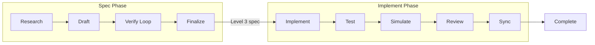
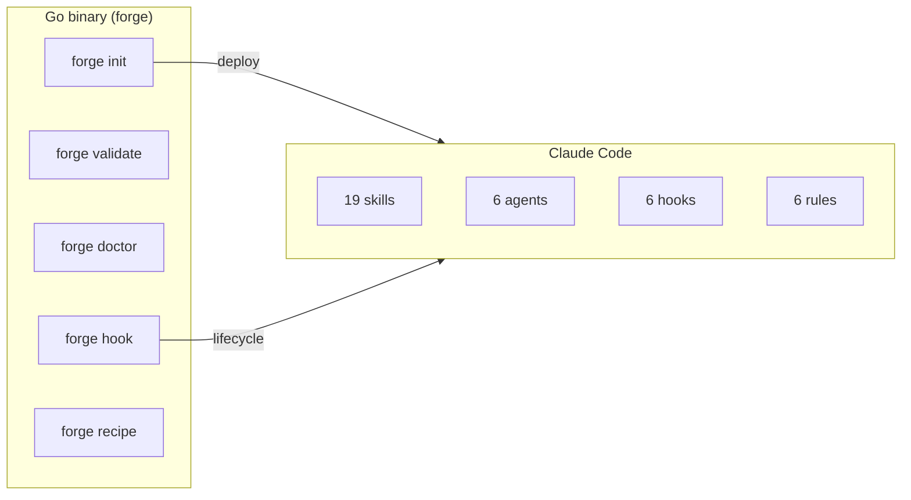

# claude-forge

文档优先AI开发 — 迭代规范，而非代码。

[](https://github.com/imtemp-dev/claude-forge/actions/workflows/ci.yml)
[](https://github.com/imtemp-dev/claude-forge/releases)
[](LICENSE)
[](https://go.dev)

[English](README.md) | [한국어](README.ko.md) | [日本語](README.ja.md)

```
╔═══════════════════════════════════════════════════════════╗
║                                                           ║
║   Ralph 模式                    Lisa 模式                 ║
║                                                           ║
║   代码 -> 失败                  规范 -> 验证              ║
║     -> 代码 -> 失败               -> 规范 -> 验证        ║
║       -> 代码 -> 失败               -> 完美规范           ║
║         -> ...                        -> 代码             ║
║           -> 能行?                      -> 能行。         ║
║                                                           ║
║   循环代码（昂贵）              循环文档（廉价）          ║
║   构建、测试、副作用            无构建、无破坏            ║
║                                                           ║
║                  claude-forge 是 Lisa 模式。              ║
║                                                           ║
╚═══════════════════════════════════════════════════════════╝
```

> **Ralph 循环代码。Lisa 循环文档。**
> 两者都迭代直到成功——但文档修改是安全的。
> 无构建、无测试、无副作用。当规范完美时，
> AI 一次生成可运行的代码。

## 快速开始

需要 [Claude Code](https://docs.anthropic.com/en/docs/claude-code)。

```bash
# Homebrew (macOS / Linux)
brew tap imtemp-dev/tap
brew install forge

# 或一行安装
curl -fsSL https://raw.githubusercontent.com/imtemp-dev/claude-forge/main/install.sh | bash

# 或从源码构建 (Go 1.22+)
git clone https://github.com/imtemp-dev/claude-forge.git && cd claude-forge && make install

# 在项目中初始化
cd your-project
forge init .

# 启动 Claude Code
claude
```

然后在 Claude Code 中：

```bash
# 创建完美规范 → 实现 → 测试 → 完成
/recipe blueprint "添加 OAuth2 认证"

# 修复已知漏洞
/recipe fix "登录 bcrypt 哈希比较失败"

# 调试未知问题
/recipe debug "5分钟后会话断开"
```

## 工作原理

forge 自动化从规范到可运行代码的完整周期：



**规范阶段** — 调研代码库，起草详细规范，然后通过多轮验证，直到每个文件路径、函数签名、类型和边界情况都确定下来（Level 3）。验证使用独立的 AI 上下文，因此规范永远不会自我验证。

**实现阶段** — 从最终规范生成代码，运行测试，模拟代码路径，审查质量，并将任何偏差同步回规范。每个步骤都有自动门控，在满足要求之前阻止完成。

**完成门控** — `forge` 自动验证完成标记。规范必须通过验证才能定稿。实现必须通过测试、审查和同步才能完成。

## 配方

| 配方 | 用途 | 输出 |
|------|------|------|
| `/recipe blueprint` | 完整实现规范 | Level 3 规范 → 代码 → 测试 |
| `/recipe design` | 设计功能 | Level 2 设计文档 |
| `/recipe analyze` | 理解现有系统 | Level 1 分析文档 |
| `/recipe fix` | 已知漏洞修复 | 修复规范 → 代码 → 测试 |
| `/recipe debug` | 未知漏洞调查 | 6视角分析 → 规范 → 代码 |

对于多功能项目，forge 将工作分解为**愿景 + 路线图**。每个配方映射到路线图项目，完成状态自动跟踪。

## 功能

### 19 个技能

| 类别 | 技能 |
|------|------|
| **配方** | blueprint, design, analyze, fix, debug |
| **验证** | verify, cross-check, audit, assess, sync-check |
| **分析** | research, simulate, debate, adjudicate |
| **实现** | implement, test, sync, status |
| **质量** | review (basic / security / performance / patterns) |

### 生命周期钩子

| 钩子 | 用途 |
|------|------|
| session-start | 上下文感知恢复（注入配方状态 + 下一步提示） |
| stop | 完成门控（在允许完成前验证规范、测试、审查） |
| pre-compact | 上下文压缩前快照工作状态 |
| session-end | 为跨会话恢复持久化工作状态 |

### 状态栏

```
forge v0.1.0 │ JWT auth │ implement 3/5 │ ctx 60%
```

在 Claude Code 状态栏中实时显示配方进度、阶段和上下文使用情况。

## 架构



**Go 二进制文件** — 单一静态链接二进制文件（约 5ms 启动）。管理状态、验证完成、部署模板。除 Go 之外零运行时依赖。

**Claude Code** — 技能提供配方协议，代理运行独立验证，钩子处理生命周期事件，规则强制约束。

## 核心原则

- **文档优先** — 迭代规范，而非代码
- **禁止自我验证** — 验证使用独立的代理上下文
- **上下文即胶水** — 技能提供情境感知，而非强制规则
- **偏差 = 后续工作** — 规范与代码的差异是报告，不是关卡
- **崩溃恢复** — 通过 JSON 持久化工作状态；会话自动恢复
- **层级地图** — 轻量级项目概览，按需查看细节
- **高速** — 单一 Go 二进制文件，零运行时依赖，约 5ms 启动

## CLI

```
forge init [dir]              初始化项目（部署技能、钩子、代理）
forge doctor [recipe-id]      健康检查（系统、配方、文档）
forge validate [recipe-id]    JSON 模式合规性检查
forge recipe status           显示活动配方
forge recipe list             所有配方列表
forge recipe log <id>         记录操作 / 阶段 / 迭代
forge recipe cancel           取消活动配方
forge stats                   显示项目统计
forge graph                   显示文档依赖图
forge update                  更新模板以匹配二进制版本
forge version                 显示二进制和模板版本
```

## 要求

- **Go** 1.22+（[安装](https://go.dev/dl/)）
- **Claude Code**（[安装](https://docs.anthropic.com/en/docs/claude-code)）
- **操作系统**：macOS、Linux（Windows 通过 WSL）

安装后运行 `forge doctor` 验证环境。

## 贡献

欢迎贡献。请通过 [issue](https://github.com/imtemp-dev/claude-forge/issues) 提交漏洞报告或功能请求。

```bash
# 开发环境设置
git clone https://github.com/imtemp-dev/claude-forge.git
cd claude-forge
make install          # 构建并安装到 ~/.local/bin
go test -race ./...   # 运行测试
```

## 许可证

MIT
