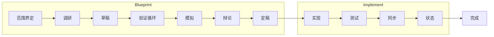
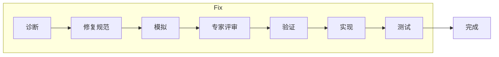
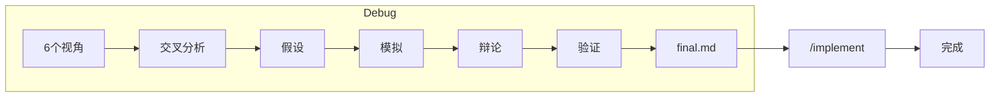

# bts — 防弹技术规范

[English](README.md) | [한국어](README.ko.md) | [日本語](README.ja.md)

```
╔════════════════════════════════════════════════════════════════╗
║                                                                ║
║   Ralph Mode                    Lisa Mode                      ║
║                                                                ║
║   code -> fail                  spec -> verify                 ║
║     -> code -> fail               -> spec -> verify            ║
║       -> code -> fail               -> spec -> verify          ║
║         -> code -> fail               -> bulletproof spec      ║
║           -> ...                        -> code                ║
║             -> works?                     -> works. first try. ║
║                                                                ║
║   Loop the CODE (expensive)     Loop the DOCS (free)           ║
║   builds, tests, side effects   no builds, no tests, no cost   ║
║                                                                ║
║                    bts is Lisa Mode.                           ║
║                                                                ║
╚════════════════════════════════════════════════════════════════╝
```

> **Ralph 循环代码。Lisa 循环文档。**
> 两者都迭代直到成功——但文档修改零成本。
> 无构建、无测试、无副作用。当规范完美时，
> AI 一次生成可运行的代码。

## 完整生命周期







bts 将**规划 → 构建 → 验证**作为一个自动化流水线覆盖。

## 安装

```bash
# 一行安装（macOS / Linux）
curl -fsSL https://raw.githubusercontent.com/jlim/bts/main/install.sh | bash

# 或从源码构建（Go 1.22+）
git clone https://github.com/jlim/bts.git
cd bts
make install    # 安装到 ~/.local/bin/bts
```

如果 `~/.local/bin` 不在 PATH 中，添加到 `.zshrc` 或 `.bashrc`：
```bash
export PATH="$HOME/.local/bin:$PATH"
```

更新：
```bash
git pull && make install
```

## 快速开始

```bash
# 在项目中初始化
bts init .

# 启动 Claude Code
claude

# 创建完美规范
/recipe blueprint "add OAuth2 authentication"

# 修复已知漏洞
/recipe fix "login bcrypt hash comparison fails"

# 调试未知问题
/recipe debug "session drops after 5 minutes"

# 代码质量审查
/bts-review
/bts-review security src/auth/

# 检查项目健康状态
bts doctor
```

## 配方

| 配方 | 用途 | 输出 |
|------|------|------|
| `/recipe analyze` | 理解现有系统 | Level 1 分析文档 |
| `/recipe design` | 设计功能 | Level 2 设计文档 |
| `/recipe blueprint` | 完整实现规范 | Level 3 规范 → 代码 → 测试 |
| `/recipe fix` | 已知漏洞修复（轻量） | 修复规范 → 代码 → 测试 |
| `/recipe debug` | 未知漏洞调查 | 6视角分析 → 规范 → 代码 |

## 技能（19个）

| 类别 | 技能 |
|------|------|
| **配方** | blueprint, design, analyze, fix, debug |
| **验证** | verify, cross-check, audit, assess, sync-check |
| **分析** | research, simulate, debate, adjudicate |
| **实现** | implement, test, sync, status |
| **质量** | review（基础 / 安全 / 性能 / 模式）|

## 核心原则

- **文档优先**：迭代规范，而非代码
- **禁止自我验证**：验证使用独立的代理上下文
- **上下文即胶水**：技能提供情境感知，而非强制规则
- **偏差 = 后续工作**：规范与代码的差异是报告，不是关卡
- **崩溃恢复**：通过 tasks.json + work-state.json 持久化工作状态
- **高速**：单一 Go 二进制文件，零运行时依赖，约 5ms 启动

## CLI

```
bts init [dir]              初始化项目
bts doctor [recipe-id]      配方健康检查（文档、清单、流程）
bts validate [recipe-id]    检查 JSON 模式合规性
bts recipe status           显示活动配方
bts recipe list             所有配方列表
bts recipe log <id>         记录操作/阶段/迭代
bts recipe cancel           取消活动配方
```

## 许可证

MIT
